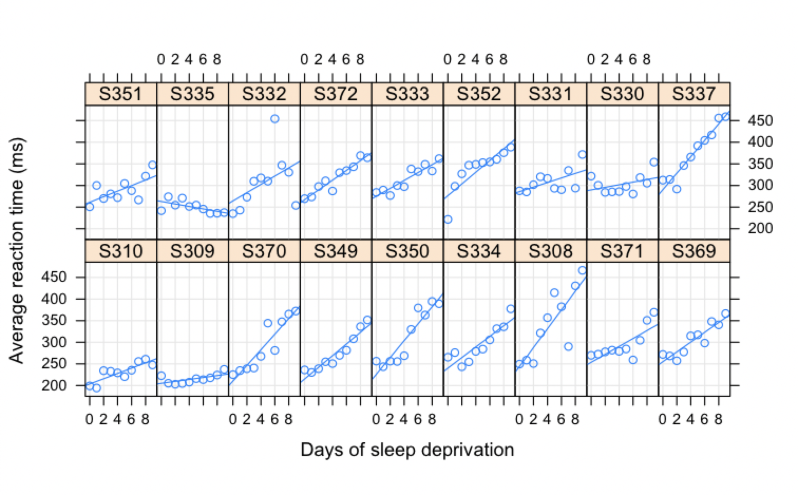

# Linear Mixed Models in Julia

This section is heavily copied from Doug Bates' work. See [his julia code](https://github.com/smlp2020-stream4/SMLP2020/blob/master/scripts/Longitudinal.jmd) and the links in the Post-workshop learning section for more information.


First, I will create a project folder with `DrWatson` to play with the linear mixed models functions:
```julia
using DrWatson
initialize_project("toy-lmm";authors="CSL")
cd("toy-lmm")
@quickactivate
```
In this project, we need to install:
```julia
(toy-lmm) pkg> add DataFrames, JellyMe4, RCall, MixedModels

(toy-lmm) pkg> status
Status `~/Dropbox/Documents/teaching/julia-workshop/toy-lmm/Project.toml`
  [a93c6f00] DataFrames v0.21.7
  [634d3b9d] DrWatson v1.16.1
  [19ac8677] JellyMe4 v0.2.1
  [ff71e718] MixedModels v3.0.0
  [6f49c342] RCall v0.13.9
```

## Running LMM in Julia

The code below is also contained in the `day1_3mixedmodels.jmd` Julia Markdown file which can be weaved into a PDF or HTML file. More details below.

```julia
using DataFrames, JellyMe4, MixedModels, RCall
```

### Data from a study on sleep deprivation

Belenky et al. (2003) conducted an experiment to measure the 
effect of sleep deprivation on cognitive performance.
There were 18 subjects, chosen from the population of interest
(long-distance truck drivers), in the 10 day trial. These subjects were  restricted to 3 hours sleep per night during the trial.

On each day of the trial each subject's reaction time was measured.
The reaction time shown here is the average of several measurements.

These data are *balanced* in that each subject is measured the same number of times and on the same occasions.

Load the data:

```julia
julia> sleepstudy = DataFrame(MixedModels.dataset(:sleepstudy));
julia> describe(sleepstudy)

3×8 DataFrame
│ Row │ variable │ mean    │ min     │ median  │ max     │ nunique │ nmissing │ eltype   │
│     │ Symbol   │ Union…  │ Any     │ Union…  │ Any     │ Union…  │ Nothing  │ DataType │
├─────┼──────────┼─────────┼─────────┼─────────┼─────────┼─────────┼──────────┼──────────┤
│ 1   │ subj     │         │ S308    │         │ S372    │ 18      │          │ String   │
│ 2   │ days     │ 4.5     │ 0       │ 4.5     │ 9       │         │          │ Int8     │
│ 3   │ reaction │ 298.508 │ 194.332 │ 288.651 │ 466.353 │         │          │ Float64  │
```

and plot the data using the _lattice_ package in R

Load the `lattice` package in `R` and set the graphics device to SVG (scalable vector graphics).

```julia
R"""
require("ggplot2", quietly=TRUE)
require("lattice", quietly=TRUE)
require("lme4", quietly=TRUE)
""";
RCall.ijulia_setdevice(MIME("image/svg+xml"), width=6, height=3.5)
```

Transfer the Julia `DataFrame` to an R `data.frame` with the same name

```julia
@rput sleepstudy;
```

and produce the plot

```julia
R"""
xy <- xyplot(
    reaction ~ days | subj, sleepstudy, aspect = "xy",
    layout = c(9,2), type = c("g", "p", "r"),
    index.cond = function(x,y) coef(lm(y ~ x))[1],
    xlab = "Days of sleep deprivation",
    ylab = "Average reaction time (ms)"
)
"""
```


## Post-workshop learning
- RePsychLing [tutorial](https://repsychling.github.io/tutorial.html)
- SMLP2020 [tutorial](https://github.com/smlp2020-stream4/SMLP2020)
- Doud Bates [NextJournal article](https://nextjournal.com/dmbates/complexity-in-fitting-linear-mixed-models) 